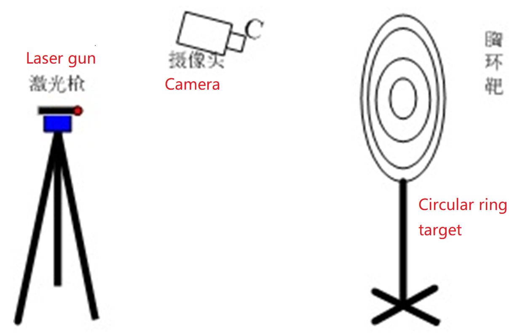

# Automatic-target-shooting-device
This is a training project when my team prepared for National Undergraduate Electronic Design Contest in 2015. We need to design an electronic system which can control laser shooting, automatic target reporting and automatic aiming.The system is composed of laser gun and aiming mechanism, circular ring target and the detection circuit of the point of impact, the structure is shown as follows. 

Our design meets all requirements. Moreover, our design used NRF24L01 to achieve remote wireless control. I was responsible for the selection of hardware and programming. This project was developed in IDE keil.
**Basic requirements**:
* The laser gun is modified with a laser pointer. The laser gun can be controlled by a circuit to emit a laser beam. The laser beam irradiates the spot diameter < 5mm on the circular ring target.The distance between the laser gun and the circular ring target is 3m.
* The laser gun is fixed on a mechanism, and the impact point of the laser gun can be controlled by the keyboard (the keyboard sets the laser beam to move up and down, left and right on the target paper for a certain distance).
* Make detection circuit of the point of impact, identify the point of impact on the circular ring target  by the camera, and display the number of rings and azimuth information of the impact point.Among them, the number of rings includes: 10, 9, 8, 7, 6, 5, miss target; Azimuth information refers to the relative position of the impact point and the area of the 10th ring, including: center, top, bottom, left, right, top left, bottom left, top right, bottom right.

 

**Advance requirements**:
* The corresponding graphics of the chest ring target are displayed on the graphic dot matrix display, and the impact point is displayed flashing.
* The laser gun is automatically controlled to quickly aim the laser beam spot from the designated position on the thoracic ring target to hit the bullseye (that is, the 10-ring area) within 15 seconds.
* The laser gun can be controlled to aim and hit the corresponding position on the chest ring target according to the number of rings set arbitrarily.

**The main hardware selections are as follows**:
* MCU ： STM32F103ZET6
* Display : TFT ILI9341
* Camera : OV7670
* Wireless : NRF24L01
* Steering engine 
* Point laser

**Project pictures**:

 

 

